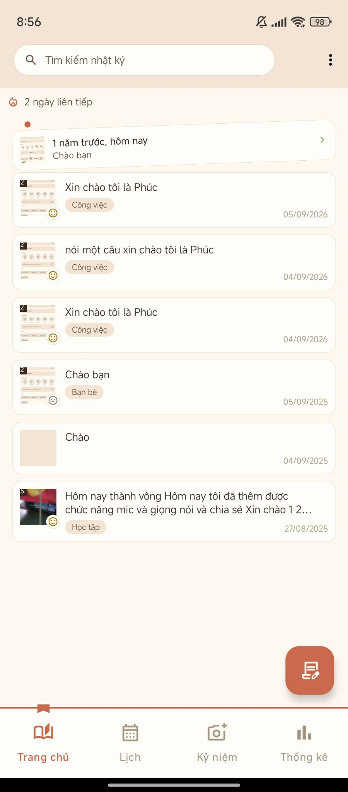
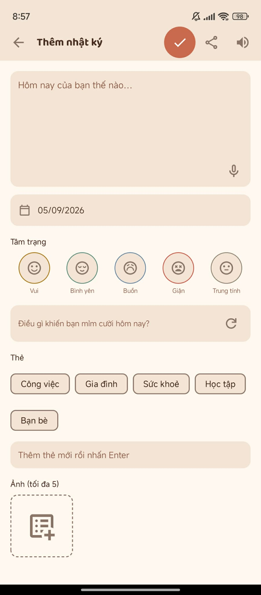
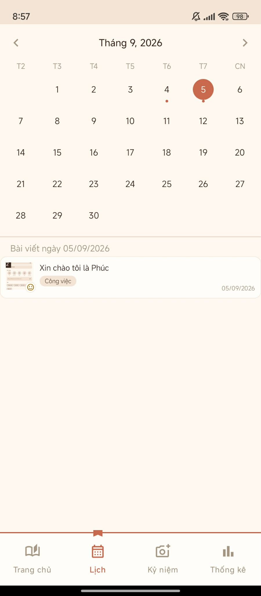
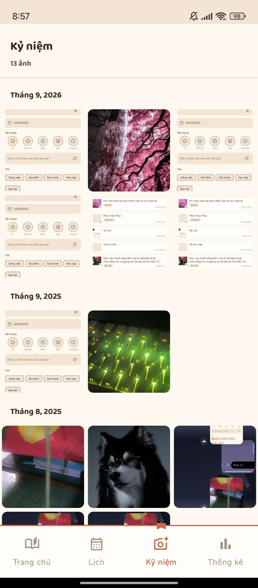
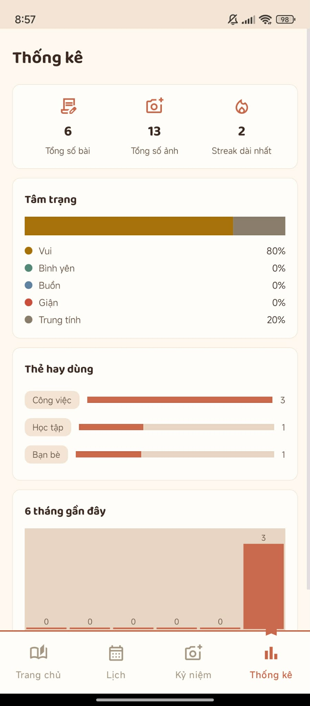

<div align="center">

# 📔 Personal Diary — Nhật Ký Cá Nhân

*Ứng dụng nhật ký cá nhân trên Android — ghi lại cảm xúc, kỷ niệm mỗi ngày*

<!-- 👇 DÒNG NÀY = NÚT LINK VIDEO DEMO. Link nằm trong dấu ( ) cuối dòng, sau khi ")]" -->
[](https://drive.google.com/file/d/1b5Y64vabIA4OPZgO62II9mlS5gyRa8M_/view?usp=drive_link)
<!-- 👇 DÒNG NÀY = NÚT LINK BÁO CÁO. Link nằm trong dấu ( ) cuối dòng, sau khi ")]" -->
[](https://docs.google.com/document/d/1Ucr6R7l5BN8Z5chrbbkL5xWNbmurt4W5d72luHHEQWo/edit?usp=sharing)


</div>

---

## 📖 Giới thiệu

**Personal Diary** là ứng dụng nhật ký cá nhân dành cho Android, giúp người dùng
ghi lại cảm xúc, sự kiện và kỷ niệm mỗi ngày một cách nhanh, gọn, trực quan.
Ứng dụng mang phong cách "sổ tay giấy" — góc trang gấp, ruy băng đánh dấu tab,
viền đứt nét, bảng màu ấm áp — kết hợp đầy đủ các công cụ hỗ trợ viết: tâm
trạng, ảnh, thẻ phân loại, gợi ý câu viết, nhập giọng nói và đọc to.

## ✨ Tính năng nổi bật

| Nhóm chức năng | Mô tả |
|---|---|
| 📝 Viết nhật ký | Soạn nội dung, chọn ngày, gắn 1 trong 5 tâm trạng, thêm tối đa 5 ảnh kèm chú thích, gắn thẻ phân loại, gợi ý câu viết ngẫu nhiên |
| 🎤 Giọng nói | Nhập nội dung bằng giọng nói (Speech-to-Text) |
| 🔊 Đọc to | Đọc bài viết thành tiếng (Text-to-Speech) |
| 🔍 Tìm kiếm & Lọc | Tìm theo từ khoá (không phân biệt dấu), lọc theo thẻ, sắp xếp mới/cũ nhất |
| 🔥 Streak | Đếm số ngày viết liên tiếp, hiển thị ngay ở màn Trang chủ |
| 📅 Lịch | Xem lịch theo tháng, chấm báo ngày có bài, xem bài viết theo từng ngày |
| 🖼️ Kỷ niệm | Lưới ảnh gộp từ toàn bộ nhật ký, nhóm theo tháng/năm |
| 📊 Thống kê | Tổng số bài/ảnh, streak dài nhất, tỷ lệ tâm trạng, top 5 thẻ hay dùng, biểu đồ số bài 6 tháng gần đây |
| 🔎 Xem ảnh phóng to | Pinch-zoom, vuốt chuyển ảnh trong cùng 1 bài viết |
| 📤 Chia sẻ & Xuất file | Chia sẻ 1 bài viết (kèm ảnh) qua app khác, xuất toàn bộ nhật ký ra file `.txt` |
| 🗑️ Xoá bài an toàn | Luôn hỏi xác nhận trước khi xoá — không thể hoàn tác |

## 📸 Ảnh minh hoạ (Screenshots)

<!--
👇 KHU VỰC NÀY = CHỖ ĐỂ ẢNH CHỤP MÀN HÌNH APP.
Cách làm:
1. Tạo thư mục "screenshots" trong repo (Add file → Upload files, gõ đường dẫn "screenshots/" trước khi Commit).
2. Đặt tên ảnh trùng với tên trong dấu ngoặc () bên dưới (home.png, add_edit.png, calendar.png, memories.png, stats.png)
   — hoặc đổi tên trong ngoặc () cho khớp với tên ảnh mày up lên.
3. Ảnh sẽ tự hiện ra thay cho dòng chữ "![...]" này khi mày Commit xong.
-->
| Trang chủ | Thêm/Sửa bài viết | Lịch |
|---|---|---|
|  |  |  |

| Kỷ niệm | Thống kê |
|---|---|
|  |  |

## 🛠️ Công nghệ sử dụng

| Thành phần | Chi tiết |
|---|---|
| Ngôn ngữ | Java |
| Nền tảng | Android Native (Android Studio) |
| Cơ sở dữ liệu | SQLite (`SQLiteOpenHelper` thuần, không ORM) |
| Giao diện | Material Design 3, ConstraintLayout, ViewPager2 |
| Min SDK / Target SDK | 24 / 37 |
| Build system | Gradle (Kotlin DSL) |

## 📂 Cấu trúc project

```
app/src/main/java/ntu/nguyenhoangphuc/personal_diary/
├── activity/   # AddEditDiaryActivity, SplashActivity, PhotoViewerDialog...
├── adapter/    # DiaryAdapter, DayAdapter, MemoriesAdapter, PhotoViewerAdapter
├── database/   # DiaryDatabaseHelper (SQLite)
├── fragment/   # HomeFragment, CalendarFragment, MemoriesFragment, StatsFragment
├── model/      # DiaryEntry, DiaryPhoto, AnhKyNiem, ThongKeThang, ThongKeThe
└── widget/     # ZoomableImageView, MoodRatioBarView, MonthlyBarChartView
```

## 🚀 Cài đặt & chạy thử

1. Clone repo về máy:
   ```bash
   git clone https://github.com/hoangphucnguyen580-boop/25TH2517-Personal_Diary.git
   ```
2. Mở project bằng **Android Studio** (khuyến khích bản mới nhất).
3. Đợi Gradle sync xong (lần đầu cần internet để tải dependency).
4. Chạy trên **thiết bị thật** hoặc **máy ảo (emulator)** từ Android 7.0
   (API 24) trở lên.

## 👨‍💻 Tác giả

**Nguyễn Hoàng Phúc**
Đồ Án: Nhật Ký Cá Nhân

---

<div align="center">

📔 Made with Java & Android Studio

</div>